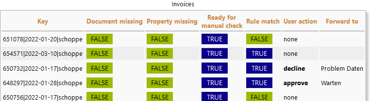

# FhG invoices
This is a Datapool processor, i.e. the class implements the processor interface. The processor provides a user interface and data processing for entries containing parsed invoices.

# Example
Each entry containing an invoice is checked aginst rules. This is done when the user presses the "Process invoices" button. The content admin or admin had configured a random threshold defining how many of the invoices matching rules (typically 100%) and not matching the rules (typically <100%>) should be held back for a manual check. All other invoices are forwarded to the canvas element selected by "Target success".

For the manual check the user gets a list of the held back invoices and is asked to "approve" or "dec.line" each invoice. Declined invoices will be forwarded to canvas element selected by "Target failure" the approved invoices will be forwarded to canvas element selected by "Target success".

 
